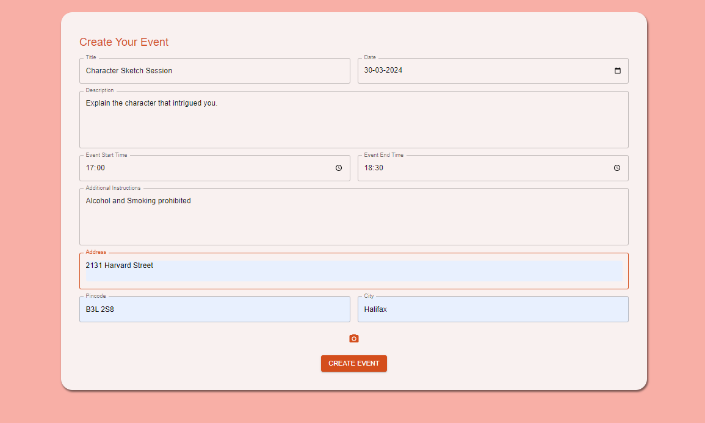

# Matchify

An app that makes you social.

### Website: [matchify.com](http://172.17.1.14:3000)

---

**Client Team:** Group-1

**Dev Team:** Group-10

---

## Table of Contents

- [Usage Scenario](#usage-scenario)
- [Detailed Use Case Scenario](#detailed-use-case-scenario)
- [Dependencies and Installation](#dependencies-and-installation)
  - [Frontend Dependencies](#frontend-dependencies)
  - [Backend Dependencies](#backend-dependencies)
  - [Build Instructions](#build-instructions)
  - [Deployment Instructions](#deployment-instructions)
- [Test Coverage for Backend](#test-coverage-for-backend)
- [Database Design](#database-design)
- [Backend APIs](#backend-apis)

## Usage scenario

### Authentication

- **Login**
- **Register**

### Filling user interests

- **Selecting general interests**
- **Selecting sub-interests**

### User dashboard/ Home page

- **Matched users**
- **Recommended events**
- **My events**
- **Event creation**
- **Logout**

### User Chat

- **User chatroom with user status**
- **User-to-user direct chat**

### Event creation

- **User event creation**

### Event details

- **View event**
- **Join or leave event**
- **List of attendees**

## Detailed Use Case Scenario

### 1. Login page

When the page is first accessed, the user is directly redirected to the login page. On this page, existing users can log in by inserting their email and password and clicking the log-in button. If the user is not already registered with the application and is new, then they can click on the “register link” provided on the Login page.


### 2. Register page

Upon clicking on the link for registering as a new user of the application (the link is available on the login page), the user will be redirected to the registration page. On the register page fields like “Name”, “E-mail”, “password”, and “City” are collected. All fields on this page are mandatory, and the password field is hidden with various constraints and a particular required format (i.e., minimum 8 characters, combination of alphanumeric characters, etc.) Once the user fills in all the required information on the register page properly, they can submit the registration form. Upon successful registration, the user will be directly redirected to the fill my interest page.


### 3. Fill my interest

After successful registration, the user then gets redirected to the “Fill my interests” page where they can fill in two different types of interests: a) Selecting general interests: The user selects from a range of general interests (sports, cooking, academics, etc.) b) Selecting sub-interests: The user selects from a list of sub-issues that are related to the general issues they selected (Sport: badminton, football, etc). Upon successfully inserting all the required fields on this page (General and sub-interests), the user will be redirected to the User dashboard / Home page with their matches based on their interest data.


### 4. User dashboard/ Home page

Once the user is successfully logged in via the “Log-in” page or the “Register page”, they’ll then redirect to the user dashboard. The dashboard contains various components for the following features: “Matched users”, “Recommended events”, “My events”, “Event creation”. An in-depth use case scenario for all these features has been given in the following sections. The user can click on the “Log-out” button to log out of the application, upon clicking on the said button the user will get logged out of the application and get redirected to the “Login page”.


### 5. Matched users

User, once logged in, could see other users with similar interests recommended for the logged-in user under the “Matched users” section. These “Matched users” are recommended based on the similarity score that is generated based on the similarity of the “interests” of users. These interests are stated by the users when they first log into the application.


### 6. Recommended events

On the user dashboard/ home page, users can see their recommended events. These events are created by other users and recommended to the logged-in user based on their interest data. User can click on the recommended events cards that will redirect them to the “Event details” page.


### 7. My events

The user can create their own events by clicking on the “Create event” button on the user dashboard. These logged-in user-created events will then get populated on the dashboard under the “Events Created By You” section. User can click on the recommended events cards that will redirect them to the “Event details” page.


### 8. Event details

Upon clicking on the event cards (either the recommended or my event cards displayed on the user dashboard), the event details page would open. On this page user can see all the event details such as Title, description, instruction, and most importantly event location and timing. User can click on the location and that will redirect them to the respective location of the event on Google Maps (This is achieved by using the latitude and longitude data) User can choose to join or leave the event and can also see the names of all the event attendees and can even chat with them by clicking on the chat icon beside their names.


### 9. User Chat

Users can engage in chat sessions with other registered users on the application. There are two ways to initiate a chat session:

- **a) Matched Users**: By clicking on the chat icon on the “Matched users” cards, users can start a chat session with the selected “Matched user.”
- **b) Event Attendees**: By clicking on the chat icon beside the names of the event attendees in the “Event attendee” list on the “Event details” page.

On the actual chat page, users will be able to engage in conversations with other users and see their online/offline status.


### 10. Event Creation

Users will be redirected to the event creation page from the user dashboard upon clicking the "Create event" button. On this page, users can enter all the required details for the event, such as the Event title, description, instructions, etc. along with an optional docs/img/image.

After submitting the event, it will be stored in the database and recommended to other users with similar interests on their dashboards/home pages.



## Dependencies and Installation

## Frontend Dependencies

### Prerequisites

Before you can install and run this React.js project, you must have the following installed on your system:

- **Node.js**: The runtime environment required to run JavaScript code outside of a browser. Node.js comes with npm (node package manager) which is used to manage project dependencies. Download and install Node.js from [the official website](https://nodejs.org/).

- **npm (Node Package Manager)**: Comes bundled with Node.js. Used to install the project's dependencies.

### Clone the Repository

First, clone the project repository from GitHub to your local machine using git command:

```bash
 git clone <repository-url>
```

The Matchify React application utilizes a range of dependencies for its functionality. Here, we document these dependencies required to build, test, and deploy the application, along with the necessary commands to install and configure them.

### Installation

To install these dependencies, navigate to your project directory in the terminal and run:

```bash
 npm install
```

### Start the development server:

```bash
 npm start
```

Runs the app in the development mode.
Open http://localhost:3000 to view it in your browser.
The page will reload when you make changes.
You may also see any lint errors in the console.

### Run test

```bash
 npm test
```

Launches the test runner in the interactive watch mode.
See the section about running tests for more information.

### Build app

```bash
 npm run build
```

Builds the app for production to the build folder.
It correctly bundles React in production mode and optimizes the build for the best performance.
The build is minified and the filenames include the hashes.
Your app is ready to be deployed!
See the section about deployment for more information.

### Eject from Create React App

```bash
 npm run eject
```

Note: this is a one-way operation. Once you eject, you can't go back!
If you aren't satisfied with the build tool and configuration choices, you can eject at any time. This command will remove the single build dependency from your project.
Instead, it will copy all the configuration files and the transitive dependencies (webpack, Babel, ESLint, etc) right into your project so you have full control over them. All of the commands except eject will still work, but they will point to the copied scripts so you can tweak them.

### Dependencies

- **Core Libraries**: `react` (^18.2.0), `react-dom` (^18.2.0)
- **Routing**: `react-router-dom` (^6.22.0)
- **State Management**: `@reduxjs/toolkit` (^2.1.0), `react-redux` (^9.1.0), `redux` (^5.0.1), `redux-persist` (^6.0.0), `redux-saga` (^1.3.0)
- **Material UI**: `@mui/material` (^5.15.9), `@mui/icons-material` (^5.15.9), `@mui/styled-engine-sc` (^6.0.0-alpha.16)
- **Emotion**: `@emotion/react` (^11.11.3), `@emotion/styled` (^11.11.0)
- **Bootstrap**: `bootstrap` (^5.3.2), `react-bootstrap` (^2.10.1)
- **WebSockets & Messaging**: `@stomp/stompjs` (^7.0.0), `sockjs-client` (^1.6.1), `stompjs` (^2.3.3)
- **HTTP Client**: `axios` (^1.6.7)
- **Testing Libraries**: `@testing-library/jest-dom` (^5.17.0), `@testing-library/react` (^13.4.0), `@testing-library/user-event` (^13.5.0)
- **Miscellaneous**: `react-hot-toast` (^2.4.1), `react-slick` (^0.30.2), `slick-carousel` (^1.8.1), `web-vitals` (^2.1.4)

### Development Dependencies

- **Tooling**: `react-scripts` (^5.0.1)

## Backend Dependencies

### Prerequisites

Before setting up the Matchify backend, ensure you have the following prerequisites installed on your system:

- **Java JDK**: The Java Development Kit (JDK) is necessary to compile and run Java applications. Matchify requires JDK 17. You can download it from [Oracle's website](https://www.oracle.com/java/technologies/javase/jdk17-archive-downloads.html) or adopt an OpenJDK distribution like [AdoptOpenJDK](https://adoptopenjdk.net/).

- **Maven**: Apache Maven is a build automation tool used primarily for Java projects. Maven simplifies the build process like compiling code, packaging binaries, and managing dependencies. Download and install Maven from [the official Apache Maven project website](https://maven.apache.org/download.cgi).

### Clone the Repository

Start by cloning the Matchify backend repository to your local machine:

```bash
 git clone <backend-repository-url>
```

### Testing

To run the backend tests, execute the following command:

```bash
 mvn test
```

This command runs all unit and integration tests in the project using Maven.

### Configuration

The backend application can be configured via the application.properties or application.yml files located in the src/main/resources directory. Here you can specify your database connections, server port, and other Spring Boot settings.

### API Documentation

After running the application you can find the API documentation using the below link.
Below link should list all the APIs that are there on our backend Spring boot application.
http://localhost:8080/swagger-ui/index.html

## Backend Dependencies

The backend of the Matchify application is built using Spring Boot, leveraging Maven for dependency management. Below is an overview of the key dependencie, which are essential for building, testing, and running the backend service.

### Key Dependencies

- **Spring Boot Starter Security**: Provides comprehensive security for Spring-based applications.
- **Spring Boot Starter Web**: Facilitates building web applications (including RESTful services) using Spring MVC.
- **Spring Boot Starter WebSocket**: Enables WebSocket development with Spring.
- **Spring Boot Starter Data JPA**: Allows easy implementation of JPA-based repositories.
- **MySQL Connector-J**: Connects the application to a MySQL database.
- **Spring Boot Starter Validation**: Supports validation functionality for Spring applications.
- **Lombok**: Reduces boilerplate code in Java classes.
- **ModelMapper**: Simplifies object mapping in Java to aid in entity and DTO mapping.
- **Spring Boot Starter Test**: Supports testing Spring Boot applications with libraries including JUnit, Hamcrest, and Mockito.
- **Spring Security Test**: Provides support for testing Spring Security applications.
- **JJWT**: Java JWT for JWT creation and verification.
- **Springdoc OpenAPI UI**: Facilitates the generation of API docs using the OpenAPI 3 specification.
- **Google Maps Services**: Enables the use of Google Maps APIs in the application.
- **AWS Java SDK**: Allows the application to interact with Amazon Web Services.

### Building and Running

### Build

Use Maven to build the project. This step compiles the Java code, runs any tests, and packages the compiled code into a JAR file:

```bash
 mvn clean install
```

If you want to skip the test execution:

```bash
 mvn clean install -DskipTests
```

### Run

After successfully building the project, you can run your Spring Boot application using Maven:

```bash
 mvn spring-boot:run
```

This command starts the Spring Boot application. By default, the application will be accessible on http://localhost:8080.

## Build Instructions
Instructions to Build the Application from Scratch.

## Frontend

**1. Set up Node.js and npm**

React.js requires Node.js and npm (Node Package Manager) to be installed on the system. These can be downloaded and installed from the official website: Node.js.

**2. Create a new React app**

- In your terminal or command prompt got to the directory where the project is to be created.
- Run the following command to create a new React app using Create React App:
  `npx create-react-app matchify`
  'matchify' is the name of the app created.

**3.** Navigate to the project directory.

**4.** By default, Create React App generates a project structure with all the necessary files and folders. Key directories include:

- public: Contains the HTML template file (index.html) and other static assets.

- src: Contains the source code of your React application.

- index.js: Entry point of your application.

- App.js: Root component of your application.
- App.css: CSS file for styling the App component.

- index.css: Global CSS styles.

- node_modules: Contains project dependencies.
- package.json: Configuration file for npm, including dependencies and scripts.

**5. Set-up the Redux Store**

- Install Redux and Redux Persist packages in the React.js project by executing the follewing commands:
  `npm install redux react-redux redux-persist`
- Set up your Redux store in the application. Create a file, store.js, and define the Redux store configurations.

```js
import { createStore, applyMiddleware } from "redux";
import { persistStore, persistReducer } from "redux-persist";
import storage from "redux-persist/lib/storage"; // defaults to localStorage for web

import rootReducer from "./reducers"; // Assuming you have your reducers defined

const persistConfig = {
  key: "root",
  storage,
};

const persistedReducer = persistReducer(persistConfig, rootReducer);

export const store = createStore(
  persistedReducer,
  applyMiddleware(/* any middleware you want to use */)
);

export const persistor = persistStore(store);
```

The above code sets up a Redux store with Redux Persist, using localStorage as the default storage engine.

- Wrap the root component with Redux's <Provider> component. This allows the Redux store to be accessible throughout the component tree:

```js
ReactDOM.render(
  <Provider store={store}>
    <PersistGate loading={null} persistor={persistor}>
      <App />
    </PersistGate>
  </Provider>,
  document.getElementById("root")
);
```

## Backend

**1. Set up your development environment**

Java and Maven have to be installed on the system. They can be downloaded and installed from their respective official websites.

**2. Create a new Maven project**

A new Maven project is created using the Maven command-line tool or an IDE like IntelliJ IDEA.

- Open the terminal or command prompt.
- Navigate to the directory where the project has to be created.
- Run the below Maven command to create the project.

```bash
mvn archetype:generate -DgroupId=com.example -DartifactId=demo -DarchetypeArtifactId=maven-archetype-quickstart -DinteractiveMode=false
```

**3. Add Spring Boot dependencies**

Edit the pom.xml file in the project directory to include Spring Boot dependencies.

```xml
    <dependency>
        <groupId>org.springframework.boot</groupId>
        <artifactId>spring-boot-starter</artifactId>
        <version>2.6.4</version> <!-- Use the latest Spring Boot version -->
    </dependency>
```

**4. Write your Spring Boot application code**

Create a new Java class and add the below code to it.

```java
   package com.example.demo;

   import org.springframework.boot.SpringApplication;
   import org.springframework.boot.autoconfigure.SpringBootApplication;
   import org.springframework.web.bind.annotation.GetMapping;
   import org.springframework.web.bind.annotation.RestController;

   @SpringBootApplication
   @RestController
   public class DemoApplication {

       public static void main(String[] args) {
           SpringApplication.run(DemoApplication.class, args);
       }

       //Other functions
   }
```

**5. Build and run your application**

Run the below command from the project directory to build the application:

`mvn clean package`

Once the build is successful, run the Spring Boot application using the below command:

`java -jar target/demo-1.0-SNAPSHOT.jar`

## Deployment Instructions:

To deploy the application to production, follow these steps:

1. **Initiate Merge Request**:

   - Create a Merge Request targeting the `main` branch in the GitLab repository.

2. **Approval Process**:

   - Ensure the Merge Request is approved by relevant stakeholders.

3. **CI/CD Pipeline**:

   - Wait for the Continuous Integration/Continuous Deployment (CI/CD) pipeline triggered by the Merge Request to complete.

4. **Production Deployment**:
   - Once the pipeline finishes, the application will automatically be deployed to the production environment.

## Test Coverage for Backend

### IntelliJ IDEA: 82%


### JaCoCo: 77%


Sure, here's the README with each stage as a top-level section:

## CI/CD Pipeline for Matchify Backend

This repository contains the CI/CD configuration for the Matchify backend application. The pipeline is configured to build, test, analyze code quality, publish Docker images, and deploy the application to a production environment.

## Pipeline Variables

The pipeline uses the following environment variables:

- `DOCKER_HUB_USER`: Docker Hub username.
- `DOCKER_HUB_PWD`: Docker Hub password.
- `SSH_PRIVATE_KEY`: Private SSH key for accessing the deployment server.
- `SERVER_USER`: Username for accessing the deployment server.
- `SERVER_IP`: IP address of the deployment server.
- `APP_NAME`: Name of the application Docker image.
- `APP_PORT`: Port on which the application should run.
- `AWS_ACCESS_KEY_ID`: AWS access key ID for accessing AWS services.
- `AWS_SECRET_ACCESS_KEY`: AWS secret access key for accessing AWS services.
- `AWS_REGION`: AWS region for accessing AWS services.
- `GEOCODING_API_KEY`: API key for geocoding services.

### Build

In this stage, the Maven project is built using the `maven:latest` Docker image. The application is packaged as a JAR file with the `test` profile activated.

### Test

The test stage executes Maven tests with the `test` profile activated.

### Quality

In this stage, code quality is analyzed using DesigniteJava. The tool identifies code smells and produces a report in the `smells/` directory.

### Publish

The Docker image is built and pushed to Docker Hub using the `docker:latest` Docker image. The image is tagged with the short commit SHA and pushed to the repository associated with the Docker Hub user.

### Deploy

The application is deployed to a production environment using SSH. The Docker image is pulled, and a container is started on the target server. Environment variables required for the application are passed during container startup.

## Pipeline Triggers

The pipeline is triggered automatically on commits to the `main` branch.

## CI/CD Pipeline for Matchify Frontend

This repository contains the CI/CD configuration for the Matchify frontend application. The pipeline is designed to build, test, analyze code quality, publish Docker images, and deploy the application to a production environment.

### Pipeline Variables

The following environment variables are utilized in the pipeline:

- `DOCKER_HUB_USER`: Docker Hub username.
- `DOCKER_HUB_PWD`: Docker Hub password.
- `SSH_PRIVATE_KEY`: Private SSH key for accessing the deployment server.
- `SERVER_USER`: Username for accessing the deployment server.
- `SERVER_IP`: IP address of the deployment server.
- `REACT_APP_API_URL`: API URL for the React application.
- `APP_NAME`: Name of the application Docker image.
- `APP_PORT`: Port on which the application should run.
- `APP_DIR`: Directory path of the frontend application.
- `APP_CONTAINER_NAME`: Name of the Docker container for the frontend application.

### Pipeline Stages

#### Build

In this stage, the Node.js project is built using the `node:latest` Docker image. Dependencies are installed using `npm ci`.

#### Test

The test stage executes the test suite for the frontend application.

#### Quality

This stage triggers a code quality analysis using an external template, specified in `Code-Quality.gitlab-ci.yml`. It only runs on the `dev` and `main` branches.

#### Publish

The Docker image is built and pushed to Docker Hub using the `docker:latest` Docker image. The image is tagged with the short commit SHA and pushed to the repository associated with the Docker Hub user.

#### Deploy

The application is deployed to a production environment using SSH. The Docker image is pulled, and a container is started on the target server. Environment variables required for the application are passed during container startup.

### Pipeline Triggers

The pipeline is triggered automatically on commits to the `main` branch.

## [Database Design](/docs/database-design/matchify-database-design.md)

This document presents the initial database design for the Matchify application, encompassing various tables and their respective columns.

## Database ERD


## Backend APIs

| Path                               | Method | Description                        | Request Structure                              | Response Structure                                        |
| ---------------------------------- | ------ | ---------------------------------- | ---------------------------------------------- | --------------------------------------------------------- |
| /api/v1/interest/fill-my-interest  | POST   | Fill user interests                | `{"groups": [1, 2], "categories": [1, 2, 3]} ` | `json<br>{"msg": "Interests filled successfully"} `       |
| /api/v1/event/matched-events       | POST   | Get matched events                 | `{"matchedUserIds": [1, 2, 3]} `               | See [GetMatchedEventsResponse](#getmatchedeventsresponse) |
| /api/v1/event/leave-event          | POST   | Leave an event                     | `{"eventAttendeesId": 123} `                   | `json<br>{"message": "Left event successfully"} `         |
| /api/v1/event/join-event           | POST   | Join an event                      | `{"eventAttendeesId": 123} `                   | `json<br>{"message": "Joined event successfully"} `       |
| /api/v1/event/event-attendees-list | POST   | Get attendees of an event          | `json <br/> {"eventId": 123} `                 | See [EventAttendeesResponse](#eventattendeesresponse)     |
| /api/v1/event/create-event         | POST   | Create an event                    | See [CreateEventRequest](#createeventrequest)  | See [CreateEventResponse](#createeventresponse)           |
| /api/v1/auth/register              | POST   | Register a new user                | See [User](#user)                              | See [SignUpResponse](#signupresponse)                     |
| /api/v1/auth/login                 | POST   | Login and get authentication token | See [LoginRequest](#loginrequest)              | See [AuthResponse](#authresponse)                         |
| /api/v1/match/findMatches          | GET    | Find matches for a user            | N/A                                            | See [FindMatchesResponse](#findmatchesresponse)           |
| /api/v1/interest                   | GET    | Fetch all interests                | N/A                                            | See [FetchInterestResponse](#fetchinterestresponse)       |
| /api/v1/event/my-events            | GET    | Get events created by user         | N/A                                            | See [GetMyEventsResponse](#getmyeventsresponse)           |

Now, for the response structures, I'll add anchor links for each response structure to provide a convenient reference. Let's define those response structures:

### GetMatchedEventsResponse

```json
{
  "eventId": 123,
  "createdBy": {
    "userId": 456,
    "firstName": "John",
    "lastName": "Doe",
    "email": "john@example.com",
    "location": "City",
    "ageRange": "18-25"
  },
  "eventName": "Event Name",
  "description": "Event Description",
  "eventDate": "2024-04-01",
  "startTime": "10:00:00",
  "endTime": "12:00:00",
  "additionalInstructions": "Additional Instructions",
  "address": "Event Address",
  "pincode": "123456",
  "city": "Event City",
  "docs/img/imageURL": "https://example.com/event_docs/img/image.jpg",
  "latitude": "123.456",
  "longitude": "456.789"
}
```

### EventAttendeesResponse

```json
{
  "userId": 123,
  "firstName": "Jane",
  "lastName": "Doe"
}
```

### CreateEventRequest

```json
{
  "eventName": "Event Name",
  "description": "Event Description",
  "eventDate": "2024-04-01",
  "startTime": { "hour": 10, "minute": 0, "second": 0, "nano": 0 },
  "endTime": { "hour": 12, "minute": 0, "second": 0, "nano": 0 },
  "additionalInstructions": "Additional Instructions",
  "address": "Event Address",
  "pincode": "123456",
  "city": "Event City"
}
```

### CreateEventResponse

```json
{
  "eventId": 123,
  "message": "Event created successfully"
}
```

### User

```json
{
  "userId": 123,
  "firstName": "John",
  "lastName": "Doe",
  "email": "john@example.com",
  "password": "hashed_password",
  "location": "City",
  "ageRange": "18-25",
  "status": "ONLINE"
}
```

### SignUpResponse

```json
{
  "token": "JWT_TOKEN",
  "message": "User registered successfully"
}
```

### LoginRequest

```json
{
  "email": "john@example.com",
  "password": "password"
}
```

### AuthResponse

```json
{
  "jwt": "JWT_TOKEN",
  "message": "Authentication successful"
}
```

### FindMatchesResponse

```json
{
  "matchedusers": [
    {
      "userId": 123,
      "name": "Jane",
      "location": "City",
      "ageRange": "18-25",
      "similarityScore": 90
    },
    {
      "userId": 456,
      "name": "John",
      "location": "City",
      "ageRange": "18-25",
      "similarityScore": 85
    }
  ]
}
```

### FetchInterestResponse

```json
{
  "groupId": 1,
  "groupName": "Group Name",
  "categories": [
    { "id": 1, "name": "Category 1" },
    { "id": 2, "name": "Category 2" }
  ]
}
```

### GetMyEventsResponse

```json
{
  "eventId": 123,
  "createdBy": {
    "userId": 456,
    "firstName": "John",
    "lastName": "Doe",
    "email": "john@example.com",
    "location": "City",
    "ageRange": "18-25"
  },
  "eventName": "Event Name",
  "description": "Event Description",
  "eventDate": "2024-04-01",
  "startTime": "10:00:00",
  "endTime": "12:00:00",
  "additionalInstructions": "Additional Instructions",
  "address": "Event Address",
  "pincode": "123456",
  "city": "Event City",
  "docs/img/imageURL": "https://example.com/event_docs/img/image.jpg",
  "latitude": "123.456",
  "longitude": "456.789"
}
```
